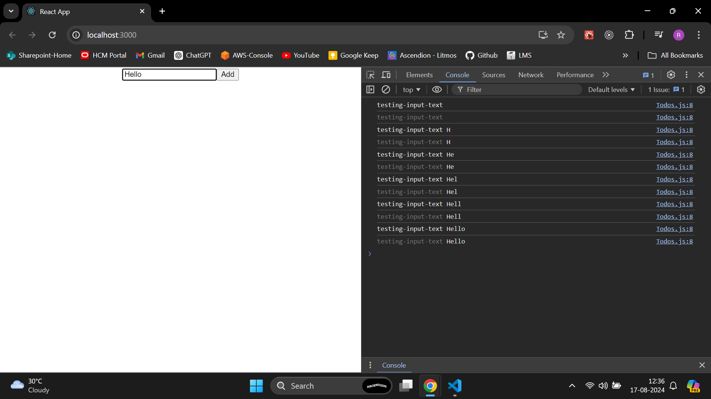
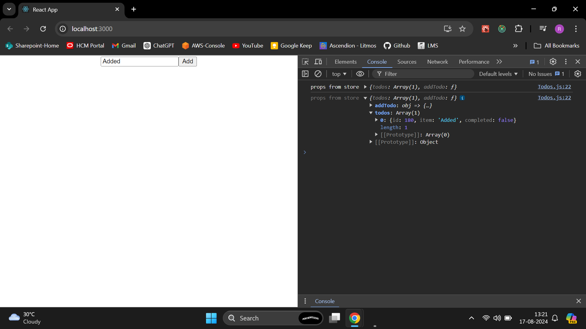
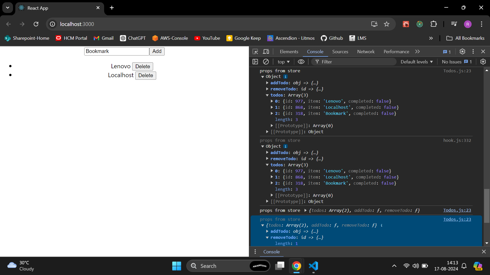
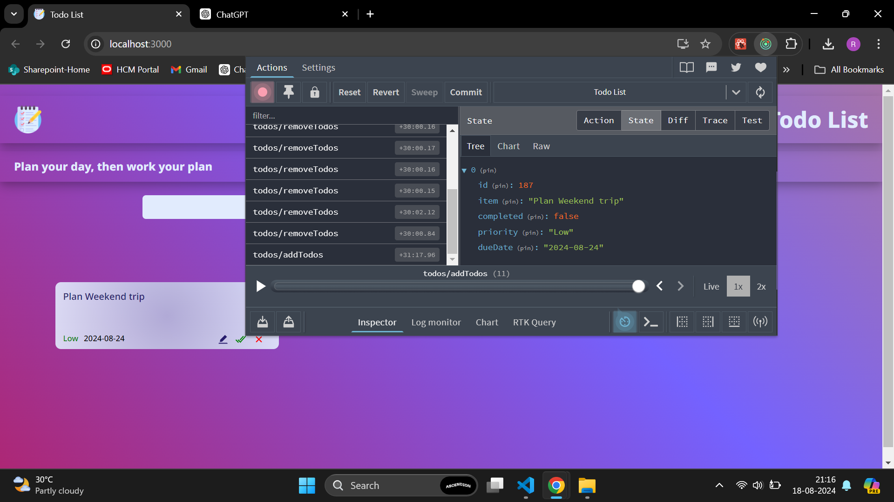

# To-Do List Application

A To-Do list application built with React, Redux, and React Hooks. This application allows users to manage their tasks with features for adding, updating, deleting, and filtering tasks. It also includes task prioritization and due dates.

## Features

- **Add Tasks**: Users can add tasks with a title, description, priority, and due date.
- **Update Tasks**: Edit task details and mark tasks as completed.
- **Delete Tasks**: Remove tasks from the list.
- **Filter Tasks**: View tasks based on their status (All, Completed, Active).
- **Prioritize Tasks**: Assign priority levels (Low, Medium, High) to tasks.
- **Sort Tasks**: Tasks are sorted based on due date.
- **LocalStorage**: Tasks are persisted using localStorage.

## Technologies Used

- **React**: Frontend library for building the user interface.
- **Redux**: State management for handling tasks.
- **React Hooks**: For managing state and lifecycle methods.
- **Framer Motion**: Animations for a smooth user experience.
- **React Icons**: For using popular icons in the application.

## Installation

1. **Clone the Repository**

   git clone https://github.com/Raghu23-dev/todo-list-app
   cd todo-list-app

Here are some preview of app 

